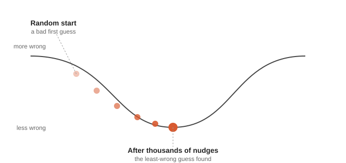

# FitWizz

A small neural net that predicts HRV from steps and sleep — built from
scratch (forward pass, loss, backpropagation, by hand) to understand
the full ML lifecycle end to end, not just call an API and call it AI.

## Why this exists

Most "AI health" side projects are a chatbot wrapped around an LLM
prompt. This isn't that. The goal was to understand — what "training a model" actually means
mechanically: a baseline, a loss function, gradients, and an honest
comparison at the end.

## Data

- **WHOOP Data Export** (`physiological_cycles.csv`) — HRV and sleep duration
- **Apple Health export** — daily step counts
- Merged on date: **342 days** where all three (steps, sleep, HRV) are present, Jan 2025–Aug 2026
- Raw personal health data is intentionally excluded from this repo (see `.gitignore`) — only code and results are public

## Methodology

- **Baseline before anything else.** A model's error number means nothing until it's compared to a dumb rule. See `02_baseline.py`.
- **Time-ordered train/test split, not random shuffle.** The most recent 20% of days are held out as a true "future" test set — random shuffling daily physiological data leaks information and produces a falsely optimistic score.
- **Backprop written by hand before using PyTorch.** `03_nn_from_scratch.py` implements the forward pass, MSE loss, and full backpropagation with plain NumPy — no autograd. This is the part of ML most practitioners never actually build themselves.
- **Diet/alcohol/illness are acknowledged as an unresolved confound**, not claimed as controlled — there's no reliable daily food-logging data behind that claim, so the honest move is naming the gap rather than hand-waving it.

## How training actually works, in plain language

A neural net is a guessing machine with adjustable numbers inside it.
Training means: make a guess, check how wrong it was, and nudge the
numbers slightly to be less wrong next time -- repeated thousands of
times until it settles somewhere.



The curve represents how wrong a guess is -- high up the slope means
very wrong, the bottom means as right as the model could get. Training
starts at a random, bad guess and rolls downhill one small step at a time.

- **Forward pass** -- plug in steps and sleep, see what HRV number the
  model currently predicts. Checking where the ball sits right now.
- **Loss** -- a number measuring how wrong that guess was. How high up
  the slope the ball is.
- **Backpropagation** -- working out which direction is downhill from
  wherever the ball currently sits. Not moving it yet, just calculating
  the direction.
- **Gradient descent** -- actually rolling it one small step in that
  downhill direction.
- **Epoch** -- one full roll. This project ran 5,000 of them in a row.
- **Weights** -- the ball's position, as actual numbers. The "2 inputs
  -> 4 hidden neurons -> 1 output" architecture just means there were a
  modest number of these adjustable numbers -- kept small on purpose,
  since there were only 273 training days to learn from.

**What actually happened here:** the training loss dropped from 1958
to 40.7 and flattened out -- proof the model genuinely found a low
point on the training data's hill. But that low point was specific to
the shape of *that* hill. Moved onto the test days -- a different
hill, since it's different data -- the same spot wasn't low anymore.
Test error (7.43ms) came in worse than simply guessing the average
(6.77ms). That gap between "fits training data" and "loses to a dumb
average on new data" is what overfitting looks like in practice, not
a bug in the code.

## Pipeline

| File | What it does |
|---|---|
| `01_load_explore.py` | Merges WHOOP + Apple Health by date, reports real data coverage — no modeling |
| `02_baseline.py` | Mean baseline and linear regression — the numbers everything else has to beat |
| `03_nn_from_scratch.py` | 2 → 4 (ReLU) → 1 neural net, hand-written forward pass and backprop |
| `05_compare.py` | Reads every result and reports the honest final verdict |

## Results

Test-set MAE, same 69 held-out days, all models:

| Model | MAE (ms) |
|---|---|
| Mean baseline | 6.77 |
| Linear regression | 6.94 |
| Neural net (from scratch) | 7.43 |

**The baseline won.** Neither the linear model nor the neural net beat simply guessing the average.

## Honest takeaway

Steps and sleep alone don't contain enough signal to predict this
person's HRV — at least not with 342 days of data. This isn't a
failed project; it's a real, defensible finding, reached by actually
comparing against a baseline instead of reporting a model's number in
isolation. The likely next step isn't a bigger model — it's better
inputs (resting HR, respiratory rate, or WHOOP's own behavioral
journal flags) or more data over time.

## Concepts this project demonstrates

- Why a baseline is mandatory, not optional, before trusting any model's score
- Time-ordered splits vs. random shuffling, and why the difference matters for time-series data
- Forward pass, loss, and backpropagation, implemented from first principles
- Feature scaling, and why it matters when inputs are on very different numeric scales
- Reporting a negative result honestly instead of tuning until something looks good

## Setup

```bash
python3 -m venv venv
source venv/bin/activate
pip install -r requirements.txt
cd src
python3 01_load_explore.py
python3 02_baseline.py
python3 03_nn_from_scratch.py
python3 05_compare.py
```